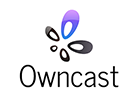

# Hetzner Cloud Owncast


<br>

Mit dieser App wird Ihr Server zu einem einsatzbereiten Live-Streaming- und Chat-Server. Mit [Owncast](https://owncast.online/) können Sie von OBS-Studio oder jeder anderen rtmp-Medienquelle streamen.

Sie können Owncast über die [Hetzner Cloud Console](https://console.hetzner.cloud) oder die [Hetzner Cloud API](https://docs.hetzner.cloud/#servers-create-a-server) installieren.

[](https://console.hetzner.cloud/deploy/owncast)

## Getting Started

Erstellen Sie sich Ihren Server wie gewohnt über die [Hetzner Cloud Console](https://console.hetzner.cloud). Alternativ zum Betriebssystem können Sie eine App wählen, die Sie gerne vorinstalliert hätten.

Die Sammlung ist in Form von [Docker-Images](https://www.docker.com/) auf dem Server vorinstalliert, aber nicht aktiviert.

Um die Sammlung zu aktivieren, melden Sie sich bitte auf Ihrem Server an:

- Per _SSH-Key_, falls Sie beim Erstellen Ihres Servers einen angegeben haben
- Per _root-Passwort_, das Sie beim Erstellen Ihres Servers per E-Mail von uns erhalten haben, wenn kein SSH-Key angegeben wurde

Dies führt Sie durch einen Prozess, wobei sie anschließend alle Services aus dem Web, mit automatischer Let's Encrypt-Unterstützung, benutzen können.

## Hetzner Cloud API

Anstelle der Hetzner Cloud Console kann zum Einrichten eines Owncast Servers auch die Hetzner Cloud API genutzt werden.

- Zum Beispiel per Curl-Befehl über die Kommandozeile

  ```
  curl \
     -X POST \
     -H "Authorization: Bearer $API_TOKEN" \
     -H "Content-Type: application/json" \
     -d '{"name":"my-owncast-server", "server_type":"cpx21", "image":"owncast"}' \
     'https://api.hetzner.cloud/v1/servers'
  ```

- Oder über [hcloud-cli](https://github.com/hetznercloud/cli)

  ```
  hcloud server create --name my-owncast-server --type cpx21 --image owncast
  ```

## Image Inhalt

### Betriebssystem

- [x] Ubuntu 24.04

### Installierte Pakete

Dieses Image enthält Docker und alle anderen aufgeführten Anwendungen als Docker Container.

| NAME       | LIZENZ             |
| ---------- | ------------------ |
| Docker     | GPLv3 (Apache 2.0) |
| Owncast    | MIT                |
| Traefik    | MIT                |
| Watchtower | GPLv3 (Apache 2.0) |

### Passwörter

Der Standard-Benutzername/Passwort für Owncast ist admin/abc123. Dies ist auch Ihr StreamKey.
Bitte ändern Sie Ihr Passwort sofort nach der Aktivierung der Sammlung.

## Links

Weitere Informationen über die installierten Pakete erhalten Sie in den offiziellen Dokumentationen:

- [Docker](https://www.docker.com/)
- [Owncast](https://github.com/owncast/owncast/)
- [Traefik](https://github.com/traefik/traefik/)
- [Watchtower](https://containrrr.dev/watchtower/)
- [Let's Encrypt](https://letsencrypt.org/de/docs/)

Weitere Informationen über Hetzner Cloud und Hetzner Cloud Apps erhalten Sie in unserer offiziellen Dokumentation:

- [Hetzner Cloud Dokumentation](https://docs.hetzner.com/de/cloud/)
- [Hetzner Cloud API](https://docs.hetzner.cloud/)
